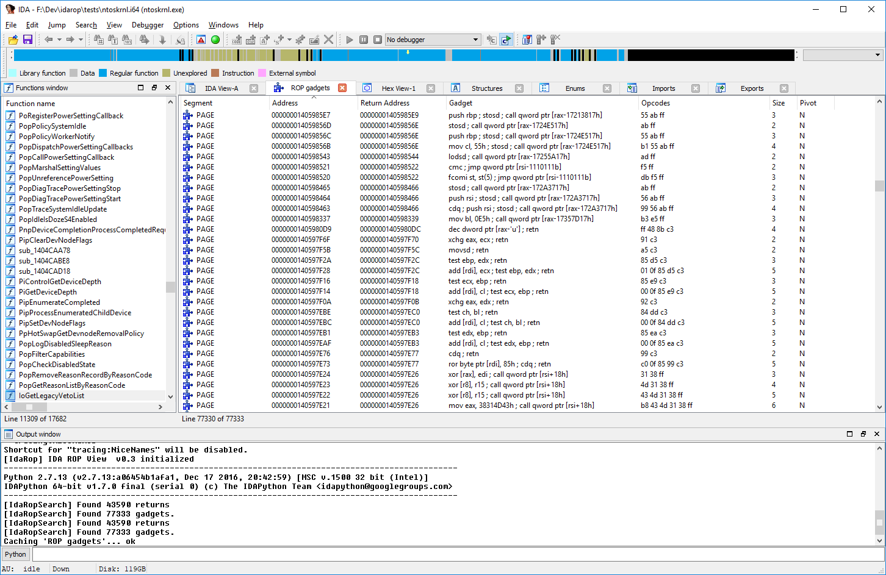
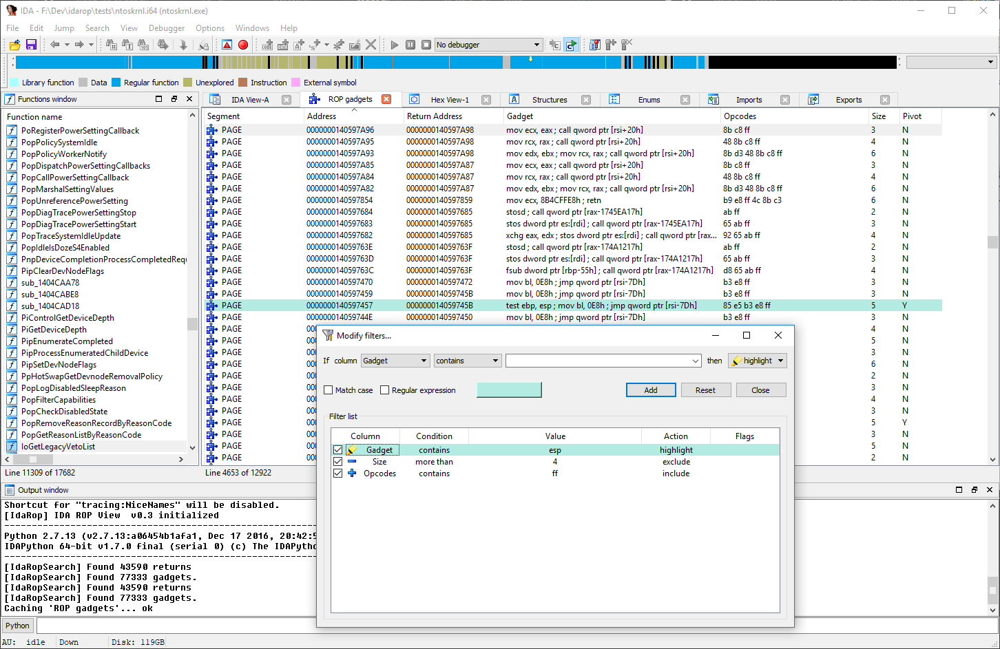
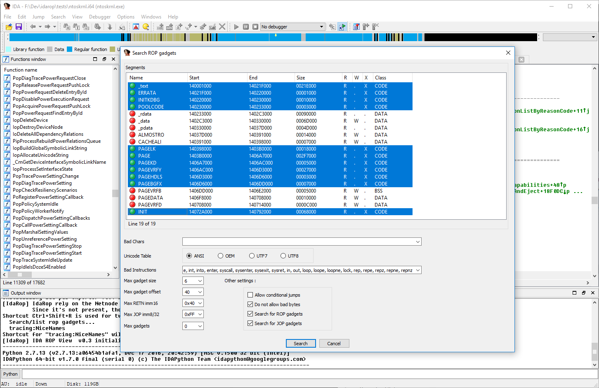

Idarop : a ROP database plugin for IDA
=========

`Idarop` is an IDA plugin which list and store all the ROP gadgets presents within the opened binary. The codebase is vastly copied from the unmaintained IDA plugin [`idaploiter`](https://github.com/iphelix/ida-sploiter). However `idasploiter` is built to work at runtime (lifting IDA debugger API), whereas `idarop` is aimed for a more static approach. 

While there is an incredible variety of ROP assisting tools ([just grep ROP in that list](http://www.capstone-engine.org/showcase.html)), most of them just output the found gadgets in the console which makes storing and searching through them a hassle. `idarop` aims to capitalize on the `idb` file format (and IDA) to store ROP gagdets along RE informations (assembly annotations, type infos, etc.) :

Using IDA to view gadgets allows the user to take advantage of the "advanced" list filtering IDA provides : in the following picture, only gadgets having a `0xff` opcode and less than 4 bytes are shown (and the ones touching `esp` are highlighted).

NB : This plugin only works on `x86` binaries.

## Dependencies

`idarop` rely on [`ida-netnode`](https://github.com/williballenthin/ida-netnode) to store found gadgets address in the `.idb` database. If `netnode` not installed, the ROP search results will just be discarded at IDA's exit. 

## Usage

`idarop` provides two shortucts :

* `Maj+R` to list found ROP gadgets  
* `Ctrl+Maj+R` to do a new gadgets search (wipes previous results)

( The search configuration and UI is copied and adapted from `idasploiter`)

## Install

`idarop` is on Pypi, so you can pip from it.

On Windows:

* `C:\Python27\Scripts\pip2.7.exe install idarop --install-option="--ida"`
* `C:\Python27\Scripts\pip2.7.exe install idarop --install-option="--ida="6.9""`

Ida is installed in the Program Files folder, so you need to run this command with Administrator rights.

Alternatively, you can clone the repo and type "`C:\Python27\python.exe setup.py install --ida`". `idarop` use a "clever" [`__ida_setup__.py`](https://github.com/lucasg/idasetup) script to override the traditionnal `distools` `install` command to install the plugin in the correct IDA plugins directory.

## Credits

Since this project is largely a ersatz of it, it would be criminal of me not to thanks [Peter Kacherginsky](https://thesprawl.org/) for its work on `idasploiter`.